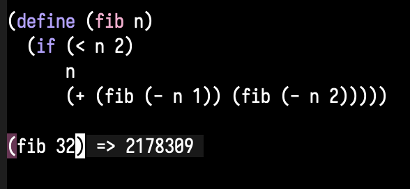

# geiser-overlay

*Overlay Scheme evaluation results*

This is mostly a s/sly-/geiser-/g of sly-overlay.
Sly-overlay borrows from EROS, which borrows from CIDER.

The primary function to call is `geiser-overlay-eval-defun`, which can be bound to
whatever is usually bound to `geiser-eval-defun`.

There is otherwise no other special setup necessary for using the library.

### Installation

`geiser-overlay` is available on MELPA and MELPA Stable.

Install it like you would any other emacs package.

### Contributing

Please someone help me move to an async geiser eval call.
